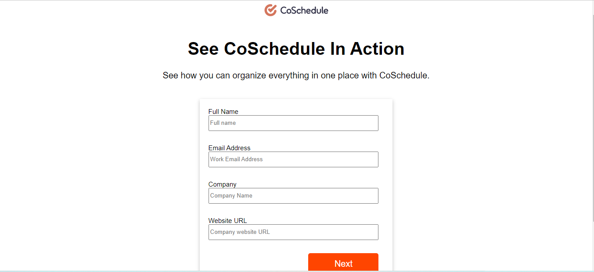

# coschedule
This is the coSchedule repository. This is team project.

For building this repository we use the techstacks as html,css,javascript.
This project build in 7 days by 5 students.

<h3>This is the home page</h3>

<h3>This is Signup page </h3>

<h3>This is the login page</h3>

