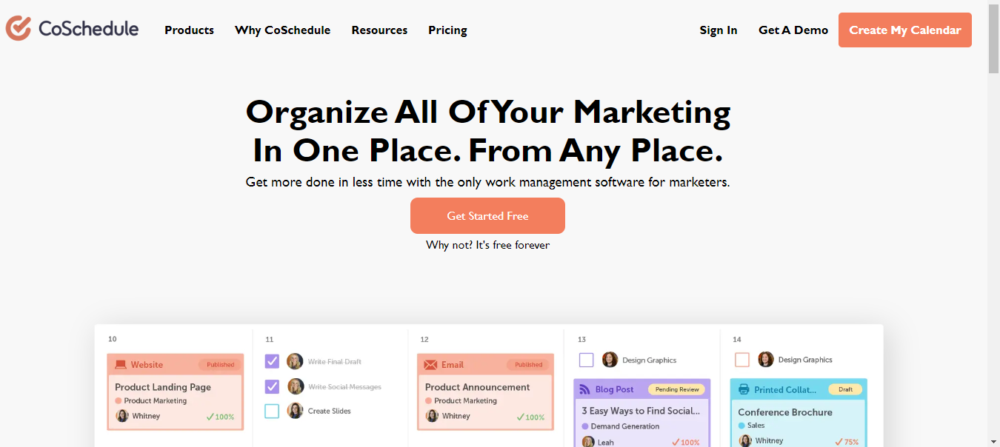

# coschedule
This is the coSchedule repository. This is team project.

For building this repository we use the techstacks as html,css,javascript.
This project build in 7 days by 5 students.

<h3>This is the home page. Here you can find the homepage of coschedule. In the homepage there is navbar. In the navbar there is signIn page and loginpage also and Calender page.</h3>

<h3>This is Signup page. In this signup page you can create a account when you don't have the account in the coschedule.After that you can see the calender page.</h3>

<h3>This is the login page. If you have an account already then you can login directly through this login page using your mail and password. </h3>

